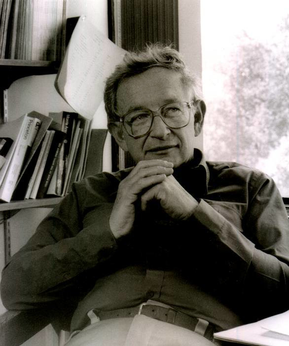

# Complexity

We feel compelled to start with one of the most famous scientific articles ever.

## More Is Different

**Author:** [Anderson, P. W.](https://en.wikipedia.org/wiki/Philip_W._Anderson)  
**Language:** English  
**Subtitle:** Broken symmetry and the nature of the hierarchical structure of science  
**Prerequisites:** 15 minutes of free time

